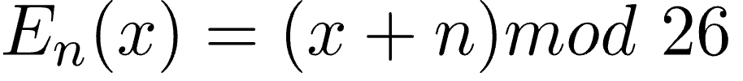
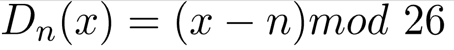
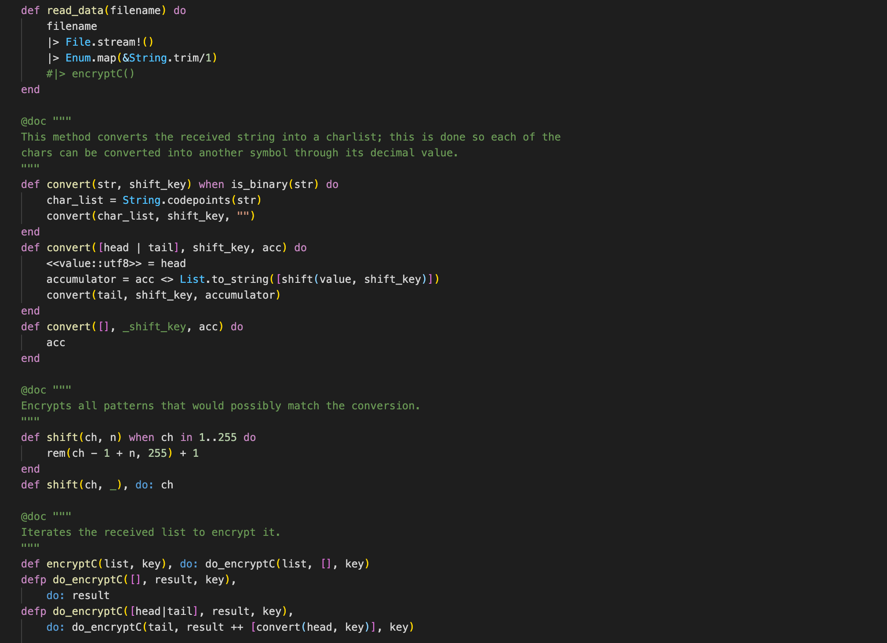
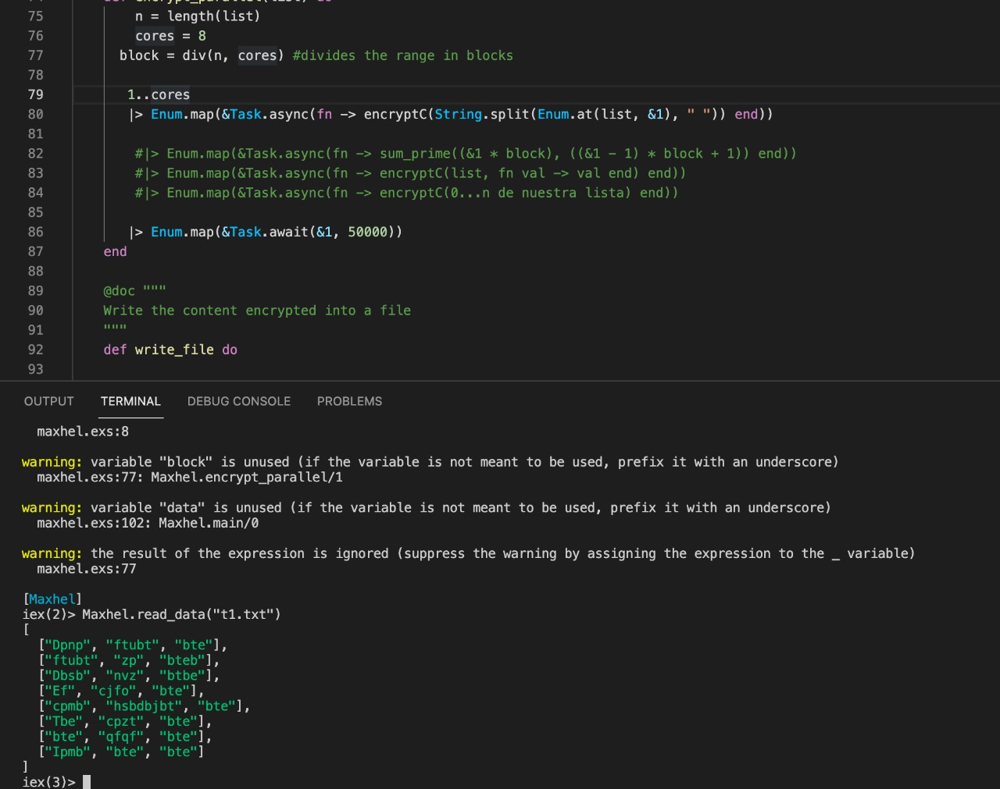
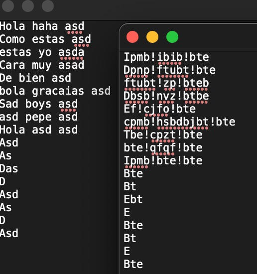

# Final Project for Programming Languages
_Maximiliano Sapien (A01027541), Aarón Rosas (A01335324), and Marcela Fuentes (A01748161)_

 

## Problem Description

Every single day, millions of files are transferred via de the Internet from people all around the world, incluidng a huge amount of personal data: emails with details about our personal lives, passwords that we type into login screens, tax documents that we upload to servers.

What if these files were intercepted while they're on their way?

It is no secret that Internet protocols send private data in packets on the same routes as everyone else's data, and unfortunately, attackers have figured out ways to look at the data travelling around the Internet.

That's where the need for encryption comes in: encrypting data means that we scramble the original data to hide the meaning of the text, while still making it possible for it to be unscrambled using a secret key.

In other words, encryption makes it possible for two people, or computers in this case, to share private information over open networks.

There are three key aspects of data encryption:
- **Encryption:** scrambling the data according to a secret key (in this case, the alphabet shift).
- **Decryption:** recovering the original data from scrambled data by using the secret key.
- **Code cracking:** uncovering the original data without knowing the secret, by using a variety of clever techniques.

Whenever we consider a possible encryption technique, we must ask ourselves some questions regarding the aforementioned aspects:
- *How easy is it to encrypt?*
- *How easy is it to decrypt?*
- *How easy is it for an attacker to crack the code?*

In the modern world, encryption is a necessary mean of security when dealing with private information being shared in the Internet. It is important to protect the data we're transferring in order to both protect our data and also ensure that the other party is receiving it correctly and without interference from any unwanted viewers.


## Solution Explanation

That's when MAXHEL comes in: we will allow the user to upload a text file that they want to either encrypt or decrypt. The language used in the development of this project will be **Elixir**.

Recursion will be needed to go through the data in the input files to do the necessary conversions for the encryption/decryption method to work. Lists will prove themselves useful by storing the ciphered/deciphered messages.

The following technique will be implemented in the program:
- **Caesar Cipher**
    - This is one of the earliest and simplest method of encryption.
    - It is a type of substitution cipher: each letter of a given text is replaced by a letter some fixed number of positions down the alphabet.
    
    - The method is named after the Roman Emperor Julius Caesar, who according to historians used this technique to communicate with his officials.
    - The encryption and decryption can be represented using modular arithmetic by first transforming the letters into numbers.
    
    
    - How will it be coded:
        - Traverse the given text one character at a time.
        - For each character, transform the given character as per the rule, depending on whether we’re encrypting or decrypting the text.
        - Return the new string generated.
        - For decryption, apply the given shift in the opposite direction to decrypt the original text.


Take a peek into how MAXHEL is coded:



MAXHEL during some of the test-phases:



How MAXHEL works:



## Prerequisites

Make sure the following requirements are met:
* Latest version of `<Elixir/dependency/requirement_1>`
    * We reccomend using the ElixirLS extension in Visual Studio Code.
* You have a `<Windows/Linux/Mac>` machine

## Installing MAXHEL

To install MAXHEL, follow the next steps:

```
gh repo clone https://github.com/Aaronrss/MAXHEL
```

## Using MAXHEL

To use MAXHEL, follow the next steps:

- First of all, navigate to the MAXHEL folder in your computer.
- Run the iex command with the relative path of the file to start an iex (Interactive Elixir) session.
```
iex MAXHEL/maxhel.exs
```

## Contributors

* [@maxsafer](https://github.com/Maxsafer) 💻 
* [@aaronrss](https://github.com/Aaronrss) 💻 
* [@marcefuentesl](https://github.com/marcefuentesl) 💻 


## References
- Fox, P. (n.d.). _The Need for Encryption_. Khan Academy. Recovered from https://www.khanacademy.org/computing/computers-and-internet/xcae6f4a7ff015e7d:online-data-security/xcae6f4a7ff015e7d:data-encryption-techniques/a/the-need-for-encryption
- GeeksForGeeks. (April 6, 2021). _Caesar Cipher in Cryptography_. Recovered from https://www.geeksforgeeks.org/caesar-cipher-in-cryptography/
- The Pragmatic Studio. (April 27, 2017). _Create a Mix Project and Run Elixir Code_. Recovered from https://pragmaticstudio.com/tutorials/create-elixir-mix-project-and-run-code
